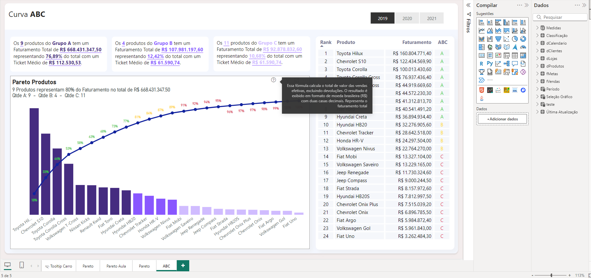

# ✨ Tooltips Amazing Tool for Power BI 📊

This project, **Tooltips Amazing Tool**, is designed to automate the documentation of Power BI reports, adding insightful tooltips to your visualizations. It helps you provide detailed descriptions for each measure, enhancing the understanding and decision-making process.



## 📂 Folder Structure

Below is the folder structure used in this project:

```
Tooltips-Amazing-Tool/
├── Tooltips.Report/
│   ├── .pbi/
│   ├── StaticResources/
│   ├── definition.pbir
│   └── report.json
├── Tooltips.SemanticModel/
│   ├── .pbi/
│   ├── editorSettings.json
│   ├── localSettings.json
│   ├── tables/
│   │   ├── Medidas.tmdl
│   │   ├── fVendas.tmdl
│   │   ├── dClientes.tmdl
│   │   └── relationships.tmdl
└── Tooltips-Amazing-Tool.pbip
```

This structure organizes all necessary Power BI resources and helps maintain the project in an efficient manner.

## 🚀 Key Features

- **Automated Tooltip Creation**: Automatically generates informative tooltips for each measure in Power BI visuals.
- **Power BI Integration**: Works seamlessly with Power BI, using the `.pbip` format to maintain a well-structured project.
- **Measure Analysis**: Analyzes and documents measures, providing clear descriptions directly within the Power BI tooltips.
- **Streamlined Process**: Reduces manual effort by automating the tooltip creation and measure documentation process.

## 🛠️ Requirements

To use the Tooltips Amazing Tool, you'll need the following:

1. **Power BI Desktop** capable of opening and saving `.pbip` files. It's crucial to save your Power BI project in this format to ensure the proper organization and functioning of the tool.
2. **Python**: For the automation scripts, make sure you have Python installed to run the necessary files that process and analyze your Power BI measures.

## 📖 How to Use

1. **Clone the repository** and open the `.pbip` file using Power BI Desktop.
2. **Upload your Power BI model files** (`.tmdl`, `.json`) to the tool, and let the automation handle the creation of tooltips.
3. **Review the generated tooltips** and customize them as needed. The tool automatically integrates the descriptions into the Power BI report.

## 📷 Dashboard Example

Here is a sample dashboard that shows the enhanced tooltips in action:


## 🎨 Credits

This tool was developed by **Ramon Roldan de Lara**.

For more details, feel free to visit [my LinkedIn profile](https://www.linkedin.com/in/ramon-roldan-de-lara/).

---
**Note**: Always ensure that your Power BI project is saved in the `.pbip` format to maintain consistency and structure across the project.
